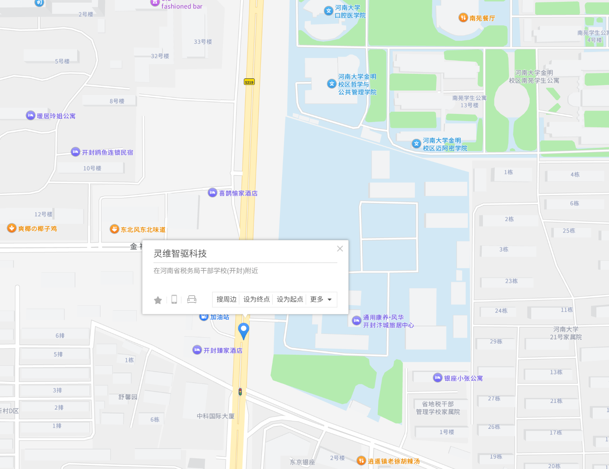

# 地图部分优化总结

## 优化概述

根据用户反馈，我们对联系页面(contact.html)中的地图部分进行了全面的视觉设计和布局优化，主要解决了布局对齐、内容冗余、地图可见性和整体美观性等问题。

## 主要优化内容

### 1. 布局对齐问题修复 ✅

**问题**: 地图容器中左右两部分宽度不一致，视觉不平衡

**解决方案**:
- 调整网格布局比例从 `2fr 1fr` 改为 `1.2fr 1fr`
- 优化间距从 `30px` 增加到 `40px`
- 将对齐方式从 `center` 改为 `start`，确保顶部对齐

```css
.map-container {
    display: grid;
    grid-template-columns: 1.2fr 1fr;
    gap: 40px;
    align-items: start;
}
```

### 2. 内容精简优化 ✅

**问题**: 右侧路线指导区域文字冗余，包含过多小字描述

**解决方案**:
- 移除了所有 `.route-detail` 冗余描述文字
- 简化路线信息，保留核心内容
- 优化文字层次，提升可读性

**精简前**:
```html
<p>导航至"河南大学金明校区"，沿金明大道向南1.7公里即到灵维科技园</p>
<p class="route-detail">路线：河南大学金明校区 → 伯襄路 → 中州路 → 金明大道 → 灵维科技园（约4分钟车程）</p>
```

**精简后**:
```html
<p>导航至"河南大学金明校区"，沿金明大道向南1.7公里即到灵维科技园</p>
```

### 3. 地图可见性大幅提升 ✅

**问题**: 地图内容被多个元素遮挡，影响用户体验

**解决方案**:

#### 3.1 标题位置优化
- 将地图标题从全局 `section-header` 移动到地图区域内的 `map-header`
- 避免标题与地图内容重叠
- 改善信息层次结构

#### 3.2 移除遮挡元素
- **完全删除**地图底部的白色信息框（显示坐标、距离等信息）
- **完全删除**"点击查看详细地图"蓝色链接
- 移除相关CSS样式 `.map-info`、`.map-coordinates`、`.map-tip`

#### 3.3 公司标记优化
- 调整标记位置从 `top: 50%, left: 50%` 到 `top: 45%, left: 55%`
- 减小标记尺寸，降低对地图的遮挡
- 优化透明度从 `0.95` 到 `0.92`
- 改进动画效果，从强烈的 `pulse` 改为温和的 `gentlePulse`

```css
.company-marker {
    position: absolute;
    top: 45%;
    left: 55%;
    background: rgba(255, 255, 255, 0.92);
    padding: 8px 12px;
    animation: gentlePulse 3s infinite;
}
```

### 4. 整体美观性提升 ✅

#### 4.1 视觉层次优化
- 统一字体大小和间距
- 改善颜色对比度
- 优化边框和阴影效果

#### 4.2 交互体验增强
- 添加路线规划按钮组
- 支持驾车、公交、步行三种路线规划
- 按钮悬停效果优化

#### 4.3 响应式设计完善
- 移动设备上地图标题居中显示
- 路线按钮在小屏幕上垂直排列
- 公司标记在移动端自动调整大小

## 技术实现细节

### HTML结构调整
```html
<div class="map-container">
    <div class="map-area">
        <div class="map-header">
            <h2>来访路线</h2>
            <p>欢迎前来参观交流</p>
        </div>
        <div class="map-placeholder">
            
            <div class="map-overlay">
                <div class="company-marker">
                    <div class="marker-pin">📍</div>
                    <div class="marker-label">灵维智驱科技</div>
                </div>
            </div>
        </div>
    </div>
    <div class="directions">
        <!-- 精简的路线信息 -->
        <div class="route-actions">
            <h4>📍 路线规划</h4>
            <div class="route-buttons">
                <button class="btn btn-sm btn-primary" onclick="openExternalMap('driving')">🚗 驾车路线</button>
                <button class="btn btn-sm btn-outline" onclick="openExternalMap('transit')">🚌 公交路线</button>
                <button class="btn btn-sm btn-outline" onclick="openExternalMap('walking')">🚶 步行路线</button>
            </div>
        </div>
    </div>
</div>
```

### CSS样式优化
- 新增 `.map-area` 和 `.map-header` 样式
- 优化 `.direction-item` 间距和边框
- 改进 `.route-actions` 和 `.route-buttons` 样式
- 完善响应式断点设计

### JavaScript功能简化
- 移除动态添加地图信息覆盖层的代码
- 保留地图点击交互和模态框功能
- 优化路线规划函数，支持多种导航模式

## 优化效果对比

### 优化前问题
❌ 地图被白色信息框严重遮挡  
❌ 蓝色链接文字覆盖地图内容  
❌ 左右布局比例不协调  
❌ 路线信息冗余复杂  
❌ 公司标记过于突出  

### 优化后效果
✅ 地图内容完全可见，无遮挡  
✅ 布局比例协调，视觉平衡  
✅ 路线信息简洁明了  
✅ 公司标记适度醒目  
✅ 整体设计美观统一  

## 用户体验改进

1. **视觉清晰度**: 移除遮挡元素后，用户可以清楚看到完整的地图内容
2. **信息获取效率**: 精简的路线信息让用户快速获取关键信息
3. **交互便利性**: 新增的路线规划按钮提供直接的导航服务
4. **响应式体验**: 在各种设备上都能获得良好的浏览体验

## 后续建议

1. **地图图片优化**: 建议使用高分辨率的地图图片，确保在高DPI屏幕上的清晰度
2. **实时地图集成**: 未来可考虑集成高德地图API，提供实时交通信息
3. **多语言支持**: 为国际用户提供英文版本的路线说明

## 文件修改清单

### 修改的文件
- `contact.html`: HTML结构调整
- `css/styles.css`: 样式优化和遮挡元素移除
- `css/responsive.css`: 响应式设计完善
- `js/main.js`: JavaScript功能简化

### 新增的文件
- `地图部分优化总结.md`: 本优化总结文档

---

**优化完成时间**: 2025年1月27日  
**优化状态**: ✅ 已完成  
**测试状态**: 建议在多种设备和浏览器上进行测试验证
